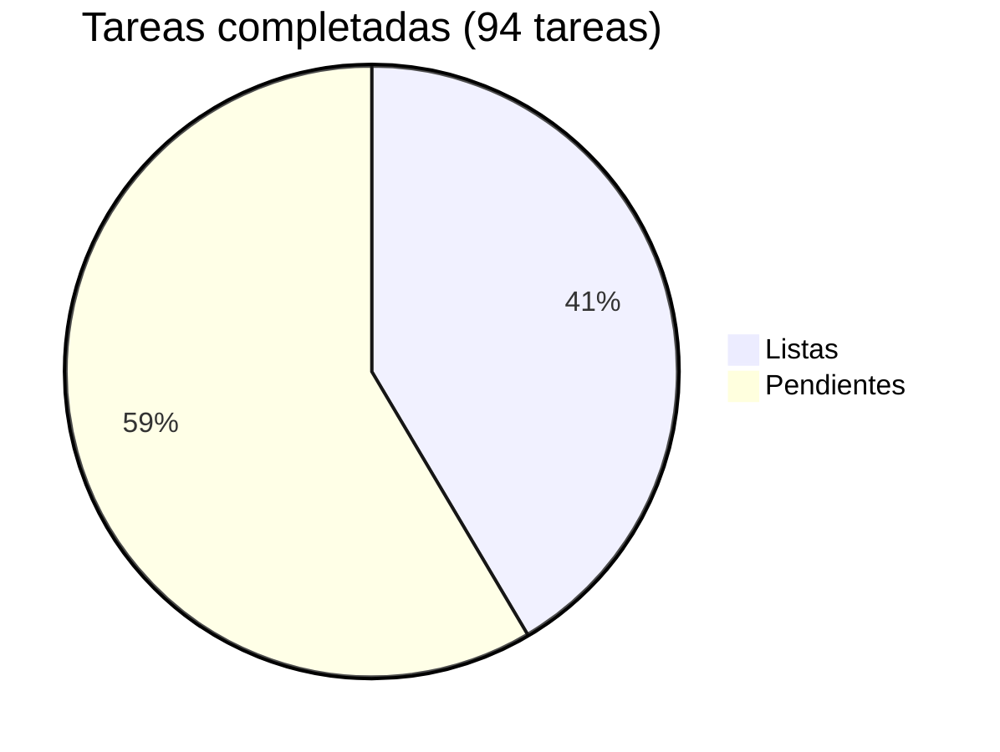

# Acopio — Roadmap

## Progreso general



| Fase | Nombre | Listas | Pendientes | Progreso |
|------|--------|-------:|-----------:|----------|
| 0 | [Scaffolding + multi-tenant + roles](phase-00-scaffolding.md) | 16 | 2 | 🟡 89% |
| 1 | [Catálogo e intake con validaciones](phase-01-catalog-intake.md) | 8 | 0 | ✅ 100% |
| 2 | [Caja homogénea, QR y etiqueta](phase-02-box-qr-label.md) | 6 | 0 | ✅ 100% |
| 3 | [Tarima, envío y manifiesto](phase-03-pallet-shipment-manifest.md) | 9 | 0 | ✅ 100% |
| 4 | [Panel agregado nacional + endurecimiento + OTP + scanning móvil](phase-04-national-dashboard-hardening.md) | 0 | 17 | ⬜ 0% |
| 5 | [Studio — panel de administración + solicitudes](phase-05-studio.md) | 0 | 22 | ⬜ 0% |
| **Total** | | **39** | **55** | **🟡 41%** |

> Las tareas 1 y 2 de Fase 0 (Envs + aplicar migración) requieren acción manual con DB activa.

---

## Dependencias entre fases

```
Fase 0 ─► Fase 1 ─► Fase 2 ─► Fase 3 ─► Fase 4
                └──────────────► (panel agregado usa datos de 1–3)
                                              │
                                              └──► Fase 5 (Studio)
```

- Fase 4 (endurecimiento + scanning móvil) puede solaparse con 2–3 según prioridad mediática.
- Fase 5 (Studio) depende de Fase 0 (usuarios/roles) pero es independiente de 1–4; puede arrancarse en paralelo.

---

## Notas de edición

Cada fase vive en su propio archivo bajo `docs/roadmap/`. Al editar:

- Actualiza el archivo de fase con el cambio de tarea (✅ Done / 🟡 In progress / ⬜ Pendiente).
- Actualiza los totales y el pie chart en este índice al completar o agregar tareas.
- Nuevas fases: archivo `phase-NN-<slug>.md` + fila en la tabla de arriba.
