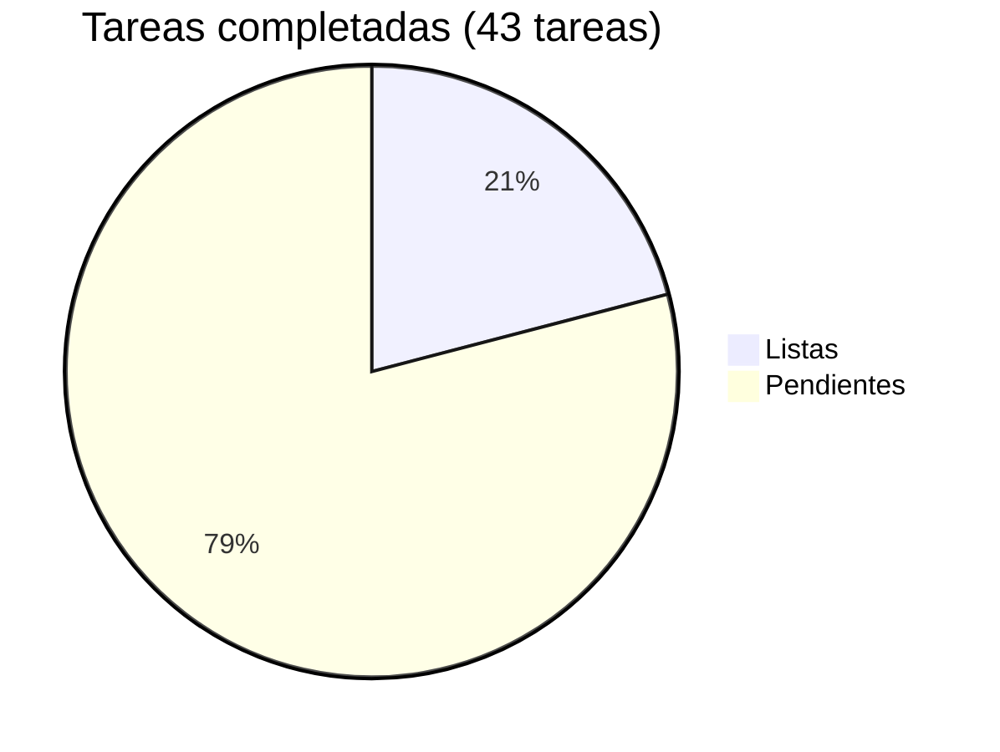

# Acopio — Roadmap

## Progreso general



| Fase | Nombre | Listas | Pendientes | Progreso |
|------|--------|-------:|-----------:|----------|
| 0 | [Scaffolding + multi-tenant + roles](phase-00-scaffolding.md) | 9 | 2 | 🟡 82% |
| 1 | [Catálogo e intake con validaciones](phase-01-catalog-intake.md) | 0 | 8 | ⬜ 0% |
| 2 | [Caja homogénea, QR y etiqueta](phase-02-box-qr-label.md) | 0 | 6 | ⬜ 0% |
| 3 | [Tarima, envío y manifiesto](phase-03-pallet-shipment-manifest.md) | 0 | 9 | ⬜ 0% |
| 4 | [Panel agregado nacional + endurecimiento](phase-04-national-dashboard-hardening.md) | 0 | 9 | ⬜ 0% |
| **Total** | | **9** | **34** | **🟡 21%** |

> Las tareas 1 y 2 de Fase 0 (Envs + aplicar migración) requieren acción manual con DB activa.

---

## Dependencias entre fases

```
Fase 0 ─► Fase 1 ─► Fase 2 ─► Fase 3 ─► Fase 4
                └──────────────► (panel agregado usa datos de 1–3)
```

Fase 4 (offline/PWA y endurecimiento) puede solaparse con 2–3 según prioridad mediática.

---

## Notas de edición

Cada fase vive en su propio archivo bajo `docs/roadmap/`. Al editar:

- Actualiza el archivo de fase con el cambio de tarea (✅ Done / 🟡 In progress / ⬜ Pendiente).
- Actualiza los totales y el pie chart en este índice al completar o agregar tareas.
- Nuevas fases: archivo `phase-NN-<slug>.md` + fila en la tabla de arriba.
